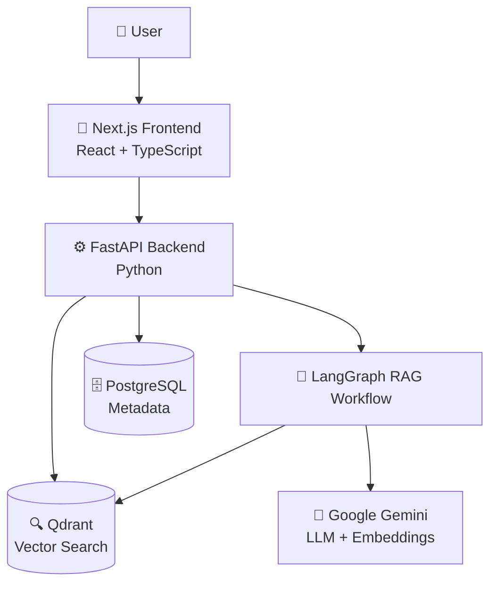
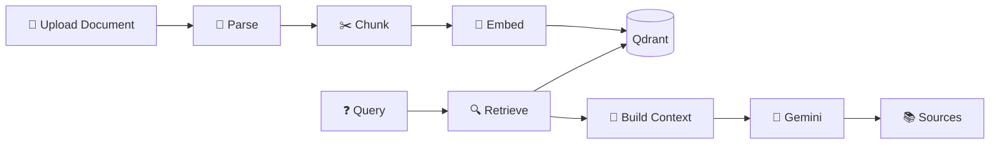
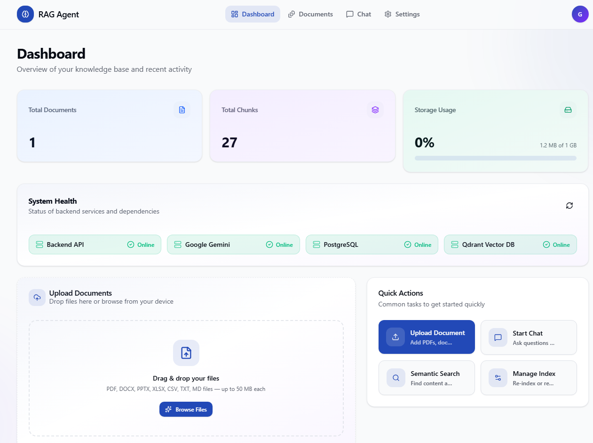
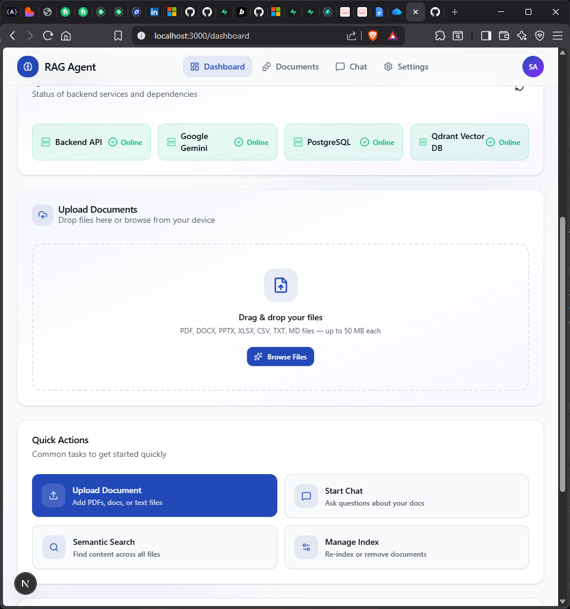
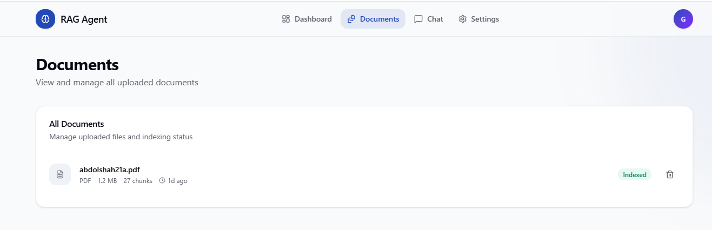
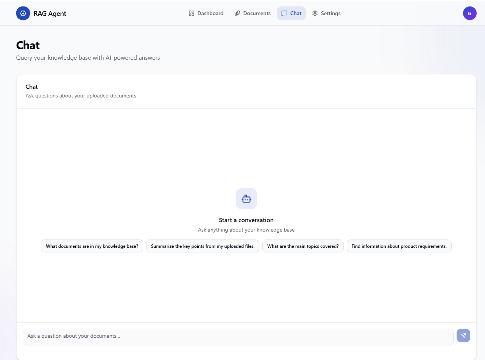

<div align="center">

# 🚀 Production RAG Agent

### Enterprise-Grade Retrieval-Augmented Generation Platform

> Build intelligent, document-grounded AI assistants with semantic retrieval, vector search, LangGraph orchestration, and Gemini-powered generation.

[](https://www.python.org/)
[](https://fastapi.tiangolo.com/)
[](https://nextjs.org/)
[](https://www.typescriptlang.org/)
[](https://www.langchain.com/langgraph)
[](https://ai.google.dev/)
[](https://www.postgresql.org/)
[](https://qdrant.tech/)
[](https://www.docker.com/)

[](https://git.io/typing-svg)

</div>

<p align="center">
  <a href="#-overview">Overview</a> •
  <a href="#-feature-showcase">Features</a> •
  <a href="#%EF%B8%8F-system-architecture">Architecture</a> •
  <a href="#-rag-workflow">RAG Pipeline</a> •
  <a href="#-application-showcase">Screenshots</a> •
  <a href="#%EF%B8%8F-technology-stack">Tech Stack</a> •
  <a href="#-getting-started">Getting Started</a> •
  <a href="#-api">API</a> •
  <a href="#-production-engineering">Engineering</a> •
  <a href="#%EF%B8%8F-roadmap">Roadmap</a> •
  <a href="#-author">Author</a>
</p>

<div align="center">

| 📄 Multi-format Ingestion | 🔍 Semantic Retrieval | 🤖 Gemini Generation | 🐳 Dockerized Stack |
|:---:|:---:|:---:|:---:|
| PDF, DOCX, PPTX, XLSX, CSV, TXT, MD, OCR | Qdrant vector search | Grounded, cited answers | One-command deployment |

</div>

---

## 📖 Overview

**Production RAG Agent** is a full-stack, production-oriented Retrieval-Augmented Generation (RAG) system for building AI assistants over private documents.

Rather than relying solely on an LLM's internal knowledge — or feeding it entire documents — the system converts a user's question into an embedding, performs semantic search over indexed chunks, injects only the most relevant context into the prompt, and generates a grounded answer with source citations.

```text
Question → Embedding → Semantic Retrieval → Relevant Context → Gemini → Grounded Answer + Sources
```

The project emphasizes production engineering: deterministic chunking, duplicate detection, retry handling with backoff, crash/interruption recovery, and scalable vector search — not just a demo notebook wrapped in a UI.

---

## 💡 Why Production RAG?

<table>
<tr>
<td width="50%" valign="top">

**The problem with plain LLM chat**
- No access to private/internal documents
- Full-document prompts are expensive and slow
- No traceability — answers can't be verified
- No recovery if ingestion fails midway

</td>
<td width="50%" valign="top">

**What this project adds**
- Private knowledge base via vector search
- Only relevant chunks are sent to the model
- Every answer returns its source chunks
- Resume-safe, duplicate-safe ingestion pipeline

</td>
</tr>
</table>

---

## ✨ Feature Showcase

### 📄 Document Intelligence
Multi-format ingestion for PDF, DOCX, PPTX, XLSX, CSV, TXT, and Markdown, with OCR support for images where implemented.

### 🧠 AI & RAG
Semantic search, Google Gemini-powered generation, LangGraph orchestration, grounded responses, source citations, streaming conversational RAG.

### ⚙️ Production Engineering
Deterministic chunk IDs, duplicate detection, adaptive batch embedding, exponential backoff with jitter, resume-safe indexing, health monitoring.

### 🗂️ Platform
Dashboard, document management, collections, settings, and real-time indexing status.

---

## 🏗️ System Architecture



| Component | Responsibility |
|---|---|
| 🎨 **Next.js Frontend** | Document upload, AI chat, source display, dashboard monitoring |
| ⚙️ **FastAPI Backend** | Ingestion, parsing, chunking, embeddings, retrieval, orchestration |
| 🗄️ **PostgreSQL** | Document/application metadata, processing state, conversation history |
| 🔍 **Qdrant** | Stores embeddings and performs semantic similarity search |
| 🤖 **Google Gemini** | Embedding generation and grounded answer generation (`gemini-3.6-flash`) |
| 🧩 **LangGraph** | Orchestrates retrieve → build context → generate → return sources |

---

## 🔄 RAG Workflow



### 📥 Document Ingestion
```text
Upload → Validate → Parse → Extract Metadata → OCR (if required) →
Adaptive Chunking → Generate Embeddings → Store in Qdrant → Store Metadata in PostgreSQL
```

### 🔍 Retrieval Pipeline
```text
Question → Query Embedding → Qdrant Search → Top Relevant Chunks →
Context Assembly (LangGraph) → Gemini → Answer + Sources
```

---

## 📄 Supported Formats

| Format | Status | Processing |
|---|:---:|---|
| 📕 PDF | ✅ | PDF parser |
| 📘 DOCX | ✅ | Document parser |
| 📙 PPTX | ✅ | Presentation parser |
| 📗 XLSX | ✅ | Spreadsheet parser |
| 📊 CSV | ✅ | Tabular parser |
| 📄 TXT | ✅ | Text parser |
| 📝 Markdown | ✅ | Markdown parser |
| 🖼️ Images | ⚙️ | OCR where implemented |

---

## 📸 Application Showcase

### 📊 Dashboard
Live status of the backend, Gemini, PostgreSQL, and Qdrant, along with document and chunk counts.

<p align="center">
  
</p>

### 📤 Upload Documents
Drag-and-drop ingestion with validation, duplicate detection, and progress tracking.

<p align="center">
  
</p>

### 📚 Document Management
Browse indexed documents, view chunk statistics, and manage collections.

<p align="center">
  
</p>

### 💬 AI Chat
Conversational, streaming RAG chat with markdown rendering and inline source citations.

<p align="center">
  
</p>

---

## 🎥 Product Walkthrough

```text
🎬 Interactive demo GIF coming soon
```

<details>
<summary>📌 Suggested demo script (for a future <code>docs/demo.gif</code>, ~8–15s)</summary>

```text
Open Dashboard → Upload PDF → Indexing → Open Chat → Ask Question → Show Sources
```

</details>

---

## 🧠 Example Interaction

> **User**
> What are the main contributions of this paper?

> **RAG Agent**
> Retrieves the relevant sections from the uploaded document and generates a grounded answer with source citations.

### 🛡️ Grounded, Not Guessing

```text
Question:
Who won the FIFA World Cup in 2022?

Response:
The retrieved documents do not contain information about who won the FIFA World Cup in 2022.
```

This illustrates the system's document-grounded behavior — it does not answer from unrelated general knowledge. This is a manual local check, not a formal hallucination benchmark.

---

## ⚡ Resilient Embedding Pipeline

```text
Embedding Request
      ↓
Batch Processing
      ↓
Provider Response
      ├── Success → Store Vectors
      └── Failure → Backoff → Retry → Adaptive Batch
```

Includes dynamic batch sizing, exponential backoff with jitter, concurrency control, duplicate-safe processing, resume-safe processing, and progress tracking.

> **Note:** Large documents may take longer to process when provider rate limits or quotas apply.

---

## 🏥 Health Monitoring

```text
Backend API       🟢
Google Gemini     🟢
PostgreSQL        🟢
Qdrant            🟢
```

Health endpoint: `http://localhost:8000/health`

Example healthy response:

```json
{
  "status": "ok",
  "gemini": "connected",
  "postgres": "connected",
  "qdrant": "connected"
}
```

---

## 🛠️ Technology Stack

| Layer | Technologies |
|---|---|
| 🎨 Frontend | Next.js, React, TypeScript, Tailwind CSS |
| ⚙️ Backend | FastAPI, Python, Pydantic, SQLAlchemy |
| 🧠 AI | Google Gemini, Semantic Embeddings, RAG |
| 🧩 Workflow | LangGraph |
| 🗄️ Metadata | PostgreSQL |
| 🔍 Vector Search | Qdrant |
| 🐳 Infrastructure | Docker, Docker Compose |

---

## 📂 Project Structure

```text
Production-RAG-Agent/
│
├── app/                  → Next.js pages (chat, collections, dashboard, documents, settings)
├── components/           → UI components (chat, collections, dashboard, documents, layout, settings, ui)
├── lib/                  → API clients, context, hooks, types
│
├── backend/
│   ├── app/
│   │   ├── api/
│   │   ├── db/
│   │   ├── schemas/
│   │   ├── services/
│   │   │   ├── embeddings/
│   │   │   ├── ocr/
│   │   │   └── parsers/
│   │   └── utils/
│   ├── alembic/
│   ├── tests/
│   ├── Dockerfile
│   ├── docker-compose.yml
│   └── requirements.txt
│
├── screenshots/          → README visuals
├── package.json
├── next.config.ts
├── tsconfig.json
└── README.md
```

---

## 🚀 Getting Started

### Prerequisites

- Git
- Node.js & npm
- Docker Desktop
- Google Gemini API key

### 1️⃣ Clone

```bash
git clone https://github.com/gourav-ai-engineer/RAG.git
cd RAG
```

### 2️⃣ Configure Environment

Create environment files from the supplied examples:

```text
.env                  (root / frontend)
backend/.env.example  → backend/.env
```

Example backend values:

```env
GOOGLE_API_KEY=your_api_key_here
GEMINI_MODEL=gemini-3.6-flash
```

> 🔐 Never commit `.env` files or API keys to GitHub.

### 🐳 Start Backend

```bash
cd backend
docker compose up --build
# or detached:
docker compose up -d --build
```

```bash
docker ps                 # check containers
docker compose logs -f    # follow logs
docker compose down       # stop services
```

### 🎨 Start Frontend

```bash
npm install
npm run dev
```

Open [http://localhost:3000](http://localhost:3000)

---

## 📡 API

| Service | URL |
|---|---|
| 🎨 Frontend | http://localhost:3000 |
| ⚙️ Backend API | http://localhost:8000 |
| 📚 Swagger Docs | http://localhost:8000/docs |
| ❤️ Health Check | http://localhost:8000/health |
| 🔍 Qdrant | http://localhost:6333 |

---

## 🧪 Testing

The backend contains tests and validation scripts covering document upload, duplicate detection, adaptive chunking, retrieval, conversation quality, deterministic IDs, multi-format parsing, memory behavior, concurrent processing, and file safety.

```bash
cd backend
python test_all.py
```

---

## 🏭 Production Engineering

<details>
<summary><b>🆔 Deterministic Chunk IDs</b> — stable identity for chunks across re-indexing</summary>
<br>
Chunk IDs are generated deterministically so the same content always maps to the same identifier.
</details>

<details>
<summary><b>🛡️ Duplicate Detection</b> — avoids redundant indexing</summary>
<br>
Already-indexed documents are detected and skipped to save time and compute.
</details>

<details>
<summary><b>🔄 Retry Handling</b> — recovers from transient provider failures</summary>
<br>
Exponential backoff with jitter handles rate limits and transient API errors.
</details>

<details>
<summary><b>📦 Adaptive Batching</b> — adjusts to provider limits</summary>
<br>
Batch sizes shrink or grow dynamically based on provider responses.
</details>

<details>
<summary><b>♻️ Resume-Safe Processing</b> — recovers indexing after interruption</summary>
<br>
Ingestion can resume from where it left off where implemented, rather than restarting from scratch.
</details>

<details>
<summary><b>❤️ Health Monitoring</b> — checks critical dependencies</summary>
<br>
Backend, Gemini, PostgreSQL, and Qdrant connectivity are checked via the health endpoint.
</details>

<details>
<summary><b>🐳 Containerized Infrastructure</b> — consistent local and deployed environments</summary>
<br>
Backend, PostgreSQL, and Qdrant run consistently via Docker Compose.
</details>

---

## 🧪 Engineering Validation

| Area | Status |
|---|:---:|
| Document ingestion | ✅ |
| Semantic retrieval | ✅ |
| Gemini generation | ✅ |
| Qdrant integration | ✅ |
| PostgreSQL integration | ✅ |
| Source citations | ✅ |
| Health monitoring | ✅ |
| Docker services | ✅ |
| Unsupported-question handling | ✅ |

Current validation is manual/local, not a formal benchmark suite:

```text
✓ Local end-to-end RAG test
✓ Document upload
✓ Retrieval
✓ Gemini generation
✓ Source citations
✓ Unsupported-question grounding test
✓ Health checks
```

---

## 🗺️ Roadmap

- [ ] Background Workers
- [ ] Async Upload Queue
- [ ] Redis Cache
- [ ] User Authentication
- [ ] Multi-Tenant Architecture
- [ ] Role-Based Access Control
- [ ] Observability Dashboard
- [ ] Automated RAG Evaluation
- [ ] CI/CD Pipeline
- [ ] Kubernetes Deployment
- [ ] Hybrid Search
- [ ] Reranking
- [ ] Query Rewriting

---

## 🔐 Security

- Never commit `.env`, `backend/.env`, API keys, database passwords, or private credentials
- `.env.example` and `backend/.env.example` contain placeholders only
- Verify before pushing:

```bash
git status
git ls-files | findstr /i ".env"
```

Expected tracked files should be example files only.

---

## 📄 License

This project is licensed under the [MIT License](./LICENSE).

---

## 👨‍💻 Author

**Gourav**
AI Engineer | GenAI Developer | Software Engineer

Areas of interest: Artificial Intelligence · Generative AI · Retrieval-Augmented Generation · AI Search · AI Agents · Backend Engineering · Full-Stack Development · Machine Learning

[](https://github.com/gourav-ai-engineer)

---

<div align="center">

⭐ **If you find this project useful, consider starring the repository.**

**Production RAG Agent**
*Retrieval · Reasoning · Generation · Engineering*

Built with ❤️ by Gourav

</div>